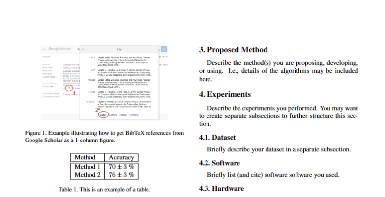
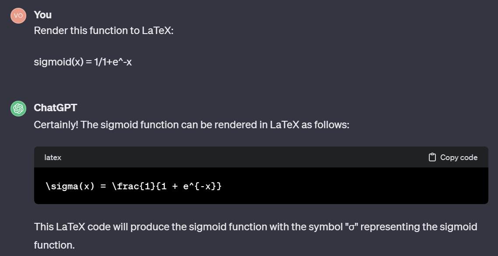

# Training for LaTeX

## Introduction

Report sẽ được nộp trong ngày **MON 27/11/2023**.

**Workflow**:

1. Clone project Project này về máy và tạo 1 branch riêng cho mình.

    ```bash
    git clone https://github.com/fuisl/LIA-introCS-proj.git
    git checkout report
    git checkout -b <branch-name>
    ```

2. Mình tự fill vô phần của mình theo đúng [format](#training). Lưu ý, chỉ edit trên phần `\section{Introduction}` (thay tên và thêm content)

    Mọi người sẽ làm report trên branch của mình. Chỉ edit file [`report.tex`](report.tex) và [`bibliography.bib`](bibliography.bib). Mọi người có thể tham khảo file [`report.pdf`](report.pdf) để xem kết quả.

3. Sau khi hoàn thành, mọi người commit changes và push changes lên branch của mình.

    ```bash
    git add .
    git commit -m "feat: add report section Introduction"
    git push origin <branch-name>
    ```

    Sau đó, mọi người sẽ tạo 1 pull request để merge vào branch `master`. Mọi người có thể tham khảo cách tạo pull request ở [link](https://docs.github.com/en/github/collaborating-with-issues-and-pull-requests/creating-a-pull-request) này.

4. Vào ngày **SUN 26/11/2023**, mình sẽ review lại report và ghép các phần lại với nhau

> *Lưu ý: Mọi người chú ý format. Nếu không đúng format thì lúc ghép vô sẽ rất khó khăn, lúc đó mọi người phải tự sửa lại theo đúng format -> mất thời gian.*

## Training

### 1. Heading

#### Section

Tiêu đề mục chính của report *(mục lớn nhất)*.

```latex
\section{Introduction}
```


> *Note: tạo tiêu đề không cần thêm số. Tiêu đề nên là `\session{Introduction}`, không phải `\session{1. Introduction}`.*

#### Subsection

Tiêu đề phụ của report. Cái này mọi người sẽ phải tự sắp xếp phần report của mình sao cho hợp lý, liên quan tới nhau.

```latex
\subsection{Introduction}
```


> ***WARNING:** mặc dù có thể tạo heading nhỏ hơn (1.1.1. Sub Subsecion), nhưng mình không khuyến khích mọi người dùng feature này, thay vào đó mọi người nên dùng **paragraph title***

#### Paragraph title

```latex
\paragraph{This is a paragraph title.} This is an example of a paragraph
```


> *Nếu structure bài viết của mọi người phức tạp, mọi người có thể thông báo lên group để mình hỗ trợ set heading & tiêu đề.*

### 2. Elements

#### Footnote

Bình thường mọi người sẽ cite bằng citation tiêu chuẩn *(xem phần [Citation](#4-citation))*, nhưng nếu mọi người muốn cite 1 đoạn text nào đó, có thể là thông tin ngoài lề, không quan trọng, hoặc 1 đoạn note nhỏ thì có thể dùng footnote.

```latex
\footnote{This is a footnote.}  % footnote ở đây

\footnote{\url{https://fb.com/Fuisloy}}  % footnote với url
```

> ***Note:** đoạn code này sẽ add vô cái text mình đang cần ref. Ví dụ bức hình dưới, mình trích thông tin của 1 paper CNN vô.*
>
> ```latex
> Convolutional Neural Networks (CNNs) \footnote{\url{https://arxiv.org/pdf/1511.08458.pdf}} have garnered particular attention and proven to be a pivotal model.
> ```
>
> *thì cuối trang đó sẽ tự add footnote vô.*
> |  |  |
> | ------------------------ | ------------------------ |

#### Picture

Hình ảnh sẽ được add vô report bằng format sau:

```latex
\begin{figure}
\begin{center}
    \includegraphics[width=0.8\textwidth]{assets/image.png}
    \caption{This is a picture.}
    \label{fig:picture}
\end{center}
\end{figure}
```

Hình ảnh sẽ được add vô report vào 1 cột được chia sẵn.



Cái này sẽ add 1 picture vô report, có caption và label. Mọi người có thể dùng label để ref lại hình ảnh đó trong report.

```latex
\ref {fig:picture}
```

> ***Note:** mọi người có thể thay đổi `width` để resize picture. Ví dụ `width=0.5\textwidth` sẽ resize picture về 50% width của page.*

Trong trường hợp mọi người muốn add hình ảnh vào giữa màn hình, thêm 1 dấu `*` vào `\begin{figure}`.

```latex
\begin{figure*}
\begin{center}
    \includegraphics[width=0.8\textwidth]{assets/image.png}
    \caption{This is a picture.}
    \label{fig:picture}
\end{center}
\end{figure*}
```

#### Table

Table sẽ được add vô report bằng format sau:

```latex
\begin{table}
\begin{center}
    \begin{tabular}{|c|c|c|}
        \hline
        \textbf{Column 1} & \textbf{Column 2} & \textbf{Column 3} \\
        \hline
        Row 1 & Row 1 & Row 1 \\
        \hline
        Row 2 & Row 2 & Row 2 \\
        \hline
    \end{tabular}
    \caption{This is a table.}
    \label{tab:table}
\end{center}
\end{table}
```

Về table, nếu có vấn đề về tạo table sao cho đúng format, mọi người có thể thông báo lên group để mình hỗ trợ.

> ***Note:** Trước khi hỏi, mọi người vui lòng đọc kĩ syntax và xem các dấu `&` `&` là gì, `/hline` có tác dụng gì để mình làm cho đúng.*

#### Math

Mọi người dùng `$$ equation $$` để wrap math equation *(tách riêng thành 1 block math)*.

```latex
$$f(\mathbf{x}; \mathbf{w}) = \sum_{i=1}^{n} w_ix_i.$$
```


hoặc mình có thể dùng `$ equation $` để wrap math equation *(Đưa vào 1 dòng văn bản*).

```latex
The equation $f(\mathbf{x}; \mathbf{w}) = \sum_{i=1}^{n} w_ix_i$ is a linear function.
```


> *Tip #1: Cheatsheet latex math: [link](https://quickref.me/latex)*.
>
> *Tip #2: Dùng ChatGPT để render code. Prompt đúng như thế này để bỏ vô cho đúng:*
> 

### 3. Formating

Dưới đây là các format text để dùng trong report latex.

|Format|Code|Example|
|------|----|-------|
|Bold|`\textbf{}`|**This is bold text**|
|Italic|`\textit{}`|*This is italic text*|
|Highlight|`\hl{}`|<mark>This is highlight text</mark>|
|Code|`\texttt{}`|`This is code text`|
|Url|`\url{}`|<https://fb.com/Fuisloy>|

> *Mình cố gắng format sao cho đúng với các paper official (Alexnet, Resnet, VGG,...)*

### 4. Citation

#### BibTeX

Mọi người sẽ dùng `\cite` để cite 1 paper.

```latex
Related work should be discussed here. This is an example of a citation \cite{name-in-latex}. To format the citations properly, put the
corresponding references into the bibliography.bib file.
```


Format `bibliography.bib`:

```json
@article{name-in-latex,
  title={Gender Privacy: An Ensemble of Semi Adversarial Networks for Confounding Arbitrary Gender Classifiers},
  author={Mirjalili, Vahid and Raschka, Sebastian and Ross, Arun},
  journal={arXiv preprint arXiv:1807.11936},
  year={2018}
}
```

Để dễ dang hơn, mọi người có thể dùng [Google Scholar](https://scholar.google.com/) để tìm paper và copy BibTeX vô. Nếu mọi người gặp khó khăn kiếm BibTeX, có thể thông báo lên group để được hỗ trợ.
